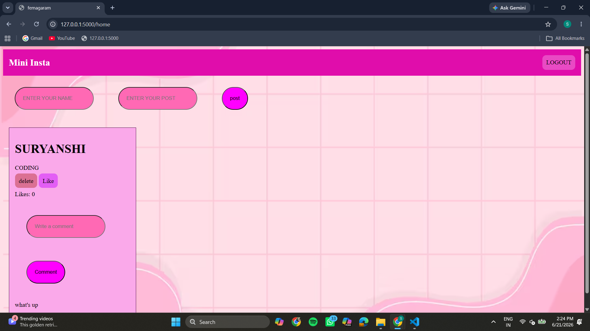
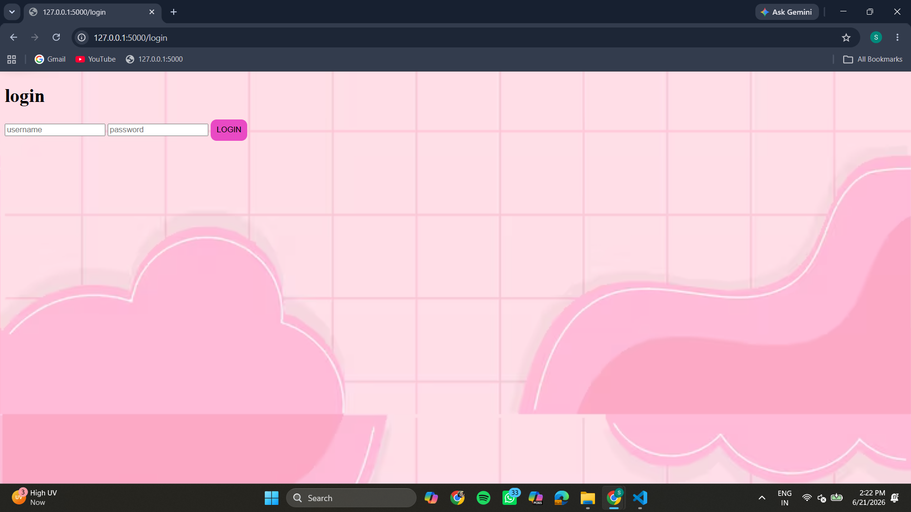

# femagram
A mini social media web app built using Flask.

## 🚀 Features
- User login & signup
- Create posts
- Like posts
- Delete posts
## 📸 Screenshots

### 🏠 Home Page

### 🔐 Login Page

### 📝 Signup Page

## 🛠️ Tech Stack
- Python (Flask)
- HTML, CSS
- SQLite

## 📸 Future Improvements
- Comments system
- Profile page
- Image upload

## 💻 Author
Suryanshi Raghuvanshi
